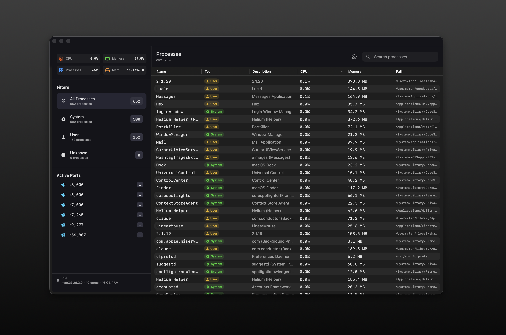

<!-- prettier-ignore -->
<div align="center">


# Lucid

**A plain-English activity monitor for macOS**

[](https://swift.org)
[](https://www.apple.com/macos)
[](LICENSE)

[Features](#features) • [Installation](#installation) • [Usage](#usage) • [Architecture](#architecture)



</div>

Lucid translates cryptic process names like `mds_stores`, `configd`, and `distnoted` into human-readable descriptions — **Spotlight Search Indexer**, **Configuration Daemon**, **Distributed Notification Service** — so you actually know what's running on your Mac.

## Features

- **Plain-English descriptions** — 450+ macOS processes mapped to readable names
- **Safety categories** — Color-coded System (protected), User (your apps), or Unknown
- **Real-time monitoring** — CPU and memory usage with sparkline charts
- **Port tracking** — See which processes are listening on which ports
- **Process termination** — Kill processes with confirmation dialogs and system protection
- **Liquid Glass design** — Native macOS 26 Tahoe glass effects with Material fallbacks
- **Pure Swift** — Zero dependencies, only Apple frameworks

## Installation

### Prerequisites

- Xcode 15+
- macOS Sonoma 14.0+

### Build from Source

```bash
git clone https://github.com/your-username/lucid-task-manager.git
cd lucid-task-manager/Lucid
make app    # Build Lucid.app
make run    # Build and launch
```

Or open `Lucid/Package.swift` in Xcode and press ⌘R.

> [!NOTE]
> Lucid disables App Sandbox to access process information. Development builds sign automatically; distribution requires a Developer ID certificate.

## Usage

1. Launch Lucid
2. Browse processes in the table — sorted by CPU by default
3. Use the sidebar to filter by category (System, User, Unknown, or by port)
4. Search by process name or description
5. Right-click to kill processes, copy paths, or reveal in Finder

### Safety Indicators

| Color | Category | Description |
|-------|----------|-------------|
| 🟢 Green | System | Protected macOS processes — cannot be killed |
| 🟡 Yellow | User | Your applications — can be terminated safely |
| ⚪ Gray | Unknown | Unidentified processes |

## Architecture

```
Lucid/
├── LucidApp.swift                 # @main entry point
├── ContentView.swift              # NavigationSplitView layout
├── Models/
│   ├── LucidProcess.swift         # Process data model
│   └── Safety.swift               # Safety enum
├── Services/
│   ├── ProcessMonitor.swift       # @Observable state, polling loop
│   ├── DarwinProcess.swift        # C interop for process APIs
│   ├── ProcessDictionary.swift    # 450+ process mappings
│   └── PortScanner.swift          # lsof-based port detection
├── Views/
│   ├── Sidebar/                   # Filters + system overview
│   ├── Content/                   # Process table + header
│   └── Dashboard/                 # Metrics + sparklines
└── Theme/
    └── GlassModifiers.swift       # Liquid Glass effects
```

**Key patterns:**
- `@Observable` ProcessMonitor as single source of truth
- Timer polling every 2 seconds
- Darwin C APIs for process enumeration

## How It Works

Lucid uses Darwin C APIs for process monitoring:

| API | Purpose |
|-----|---------|
| `proc_listallpids()` | Enumerate all running processes |
| `proc_pidinfo()` | Get CPU time and resident memory |
| `proc_name()` | Get process name (max 16 chars) |
| `proc_pidpath()` | Get executable path |
| `NSWorkspace` | Get full GUI app names |

CPU percentage is computed from nanosecond deltas in `pti_total_user` and `pti_total_system` between samples.

> [!WARNING]
> Root processes appear with 0 CPU/memory without elevated privileges. App Sandbox is disabled for process visibility.

## FAQ

<details>
<summary>Why do some processes show 0% CPU or memory?</summary>

Root/sudo processes have limited visibility through Darwin APIs without elevated privileges.
</details>

<details>
<summary>Can I distribute this on the Mac App Store?</summary>

No. Lucid requires access to process information incompatible with App Sandbox. Distribution requires a Developer ID certificate and Apple notarization.
</details>

<details>
<summary>How does Lucid get full app names?</summary>

The `proc_name` API truncates at 16 characters. Lucid works around this using `NSWorkspace.shared.runningApplications` to get full application names for GUI apps.
</details>

## Development

```bash
cd Lucid
make test    # Run unit tests
make app     # Build Lucid.app
make run     # Build and launch
```

CI runs on macOS 14 via GitHub Actions: `swift test` + `./build-app.sh debug`
