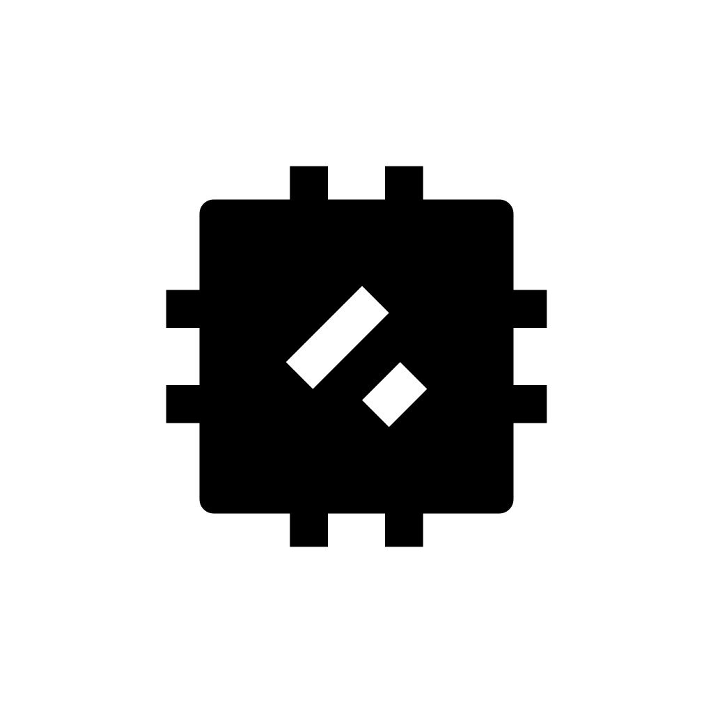
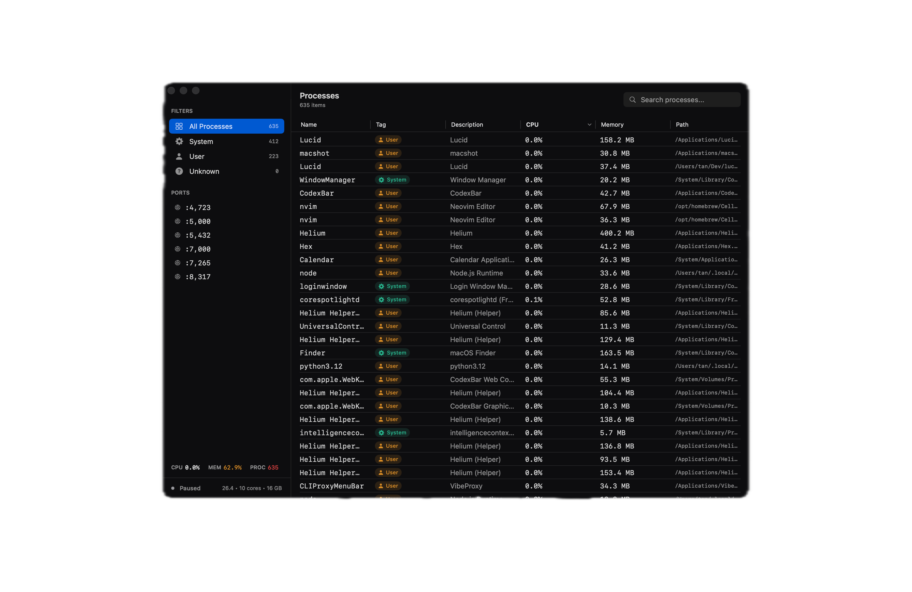

<!-- prettier-ignore -->
<div align="center">



<h1>Lucid</h1>

<p>A plain-English activity monitor for macOS built with native SwiftUI.</p>

<p>
  <a href="https://swift.org"></a>
  <a href="https://www.apple.com/macos"></a>
  <a href="https://github.com/tanRdev/lucid-task-manager/actions/workflows/ci.yml"></a>
  <a href="https://github.com/tanRdev/lucid-task-manager/releases"></a>
  <a href="LICENSE"></a>
</p>

<p><a href="#quick-start">Quick Start</a> · <a href="#installation">Installation</a> · <a href="#usage">Usage</a> · <a href="#architecture">Architecture</a> · <a href="#development">Development</a> · <a href="#resources">Resources</a></p>



</div>

> [!TIP]
> From the repo root, run `cd Lucid && make run` to build Lucid.app and launch it locally on macOS.

## Overview

**Lucid** turns cryptic process names like `mds_stores`, `configd`, and `distnoted` into plain-English descriptions so you can quickly understand what is running on your Mac, how much CPU or memory it is using, and whether it is safe to terminate.

## Quick Start

```bash
git clone https://github.com/tanRdev/lucid-task-manager.git
cd lucid-task-manager/Lucid
make run
```

This builds `Lucid.app` from source and opens it locally.

## Installation

### Requirements

- macOS 14 or newer
- A Swift toolchain that supports `swift-tools-version: 6.2`

### Build From Source

```bash
git clone https://github.com/tanRdev/lucid-task-manager.git
cd lucid-task-manager/Lucid
make app
```

The generated app bundle is placed in the Swift build output directory.

### Launch During Development

```bash
cd Lucid
make run
```

### Install To `/Applications`

```bash
cd Lucid
make install
```

Or open `Lucid/Package.swift` in Xcode and run the app there.

> [!NOTE]
> Lucid disables App Sandbox so it can inspect running processes. Development builds work locally; distributing the app outside development requires Developer ID signing and notarization.

### First Launch

macOS may display a message that the app cannot be verified. To open it:

**Option 1: Right-click**

1. **Right-click** (or Control-click) Lucid.app in Finder.
2. Select **Open** from the context menu.
3. Click **Open** in the dialog that appears.

**Option 2: Terminal**

```bash
xattr -d com.apple.quarantine /Applications/Lucid.app
```

You only need to do this once. After that, Lucid opens normally.

## Usage

1. Launch Lucid.
2. Browse live processes sorted by CPU, memory, name, or PID.
3. Search by process name or description.
4. Filter by safety category or by listening port from the sidebar.
5. Use the context menu to kill processes, copy executable paths, or reveal binaries in Finder.

### Safety Indicators

| Category | Meaning |
| --- | --- |
| System | Protected macOS processes that Lucid treats as unsafe to kill |
| User | User-installed or user-owned apps and processes |
| Unknown | Processes that could not be confidently classified |

## Features

| Feature | Description |
| --- | --- |
| Plain-English process names | Maps hundreds of common macOS processes to human-readable descriptions |
| Real-time monitoring | Tracks CPU and memory usage with compact history charts |
| Port visibility | Shows which processes are listening on which ports |
| Safer process termination | Confirms destructive actions and protects system processes |
| Native macOS interface | Built in SwiftUI with macOS-focused visuals and controls |
| Zero third-party dependencies | Uses Swift Package Manager with Apple frameworks only |

## Architecture

```text
Lucid/
├── LucidApp.swift                 # App entry point
├── ContentView.swift              # Main table and process actions
├── Models/
│   ├── LucidProcess.swift         # Process model and derived fields
│   ├── ProcessSortMode.swift      # Sorting options
│   └── Safety.swift               # Safety classification
├── Services/
│   ├── ProcessMonitor.swift       # Observable app state and refresh loop
│   ├── DarwinProcess.swift        # Darwin process API interop
│   ├── ProcessDictionary.swift    # Human-readable process name mapping
│   └── PortScanner.swift          # `lsof`-based listening port detection
├── Views/
│   ├── Content/                   # Header and process table UI
│   ├── Dashboard/                 # Metrics and sparklines
│   ├── Shared/                    # Shared safety/status components
│   └── Sidebar/                   # Filters, ports, and system summary
└── Theme/
    └── GlassModifiers.swift       # Shared surface styling
```

## How It Works

Lucid combines Darwin process APIs, AppKit metadata, and periodic polling to build a readable live view of macOS activity:

1. `proc_listallpids()` enumerates running processes.
2. `proc_pidinfo()` collects CPU time and resident memory.
3. `proc_name()` and `proc_pidpath()` identify executables.
4. `NSWorkspace.shared.runningApplications` fills in full GUI app names when system APIs truncate them.
5. `lsof -iTCP -sTCP:LISTEN -n -P` maps listening ports back to PIDs.

`ProcessMonitor` refreshes this data on a task-based loop and keeps the UI state synchronized through `@Observable` state.

> [!WARNING]
> Some root-owned processes expose limited metrics without elevated privileges, so they may appear with partial CPU or memory information.

## Development

```bash
cd Lucid
make test
make app
make run
```

The repository's CI workflow is configured to run:

- `swift build --target Lucid`
- `swift build -Xswiftc -warn-concurrency --target Lucid`
- `swift test`
- `./build-app.sh debug`

## Contributing

Contributions are welcome. Lucid is open source under the [MIT License](LICENSE).

### Ways to Contribute

- **Report bugs** — [Open an issue](https://github.com/tanRdev/lucid-task-manager/issues) with steps to reproduce
- **Suggest features** — Describe the problem you're solving before proposing solutions
- **Improve process mappings** — Add or refine human-readable descriptions in `ProcessDictionary.swift`
- **Submit pull requests** — Fork the repo, branch off `main`, and open a PR with a clear description

### Development Setup

```bash
git clone https://github.com/tanRdev/lucid-task-manager.git
cd lucid-task-manager/Lucid
make test
```

### Code Standards

- Follow existing Swift conventions and formatting
- Add tests for new functionality
- Keep commits focused and descriptive
- Run `make test` before opening a PR

## Resources

- [Releases](https://github.com/tanRdev/lucid-task-manager/releases)
- [CI Workflow](.github/workflows/ci.yml)
- [Swift Package Manifest](Lucid/Package.swift)

## License

Lucid is licensed under the MIT License. See the [`LICENSE`](LICENSE) file for details.

## Getting Help

- [Open an issue](https://github.com/tanRdev/lucid-task-manager/issues)
